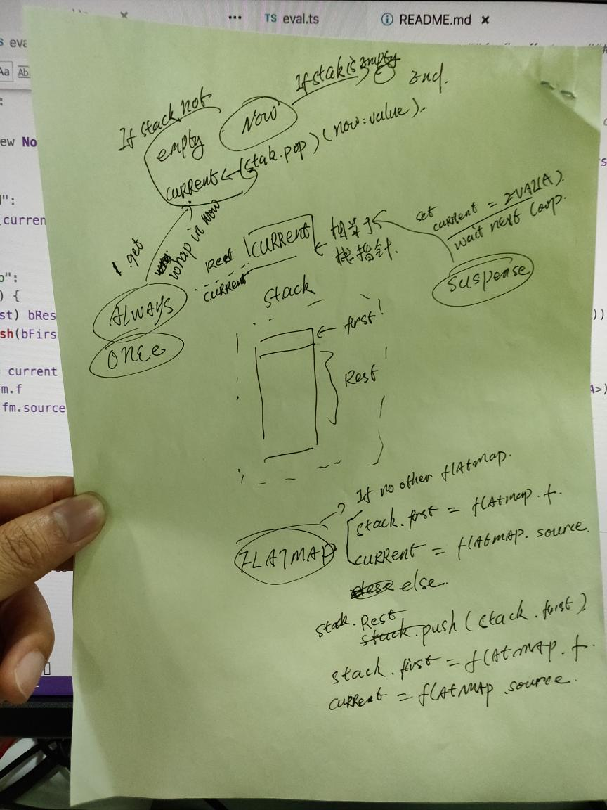
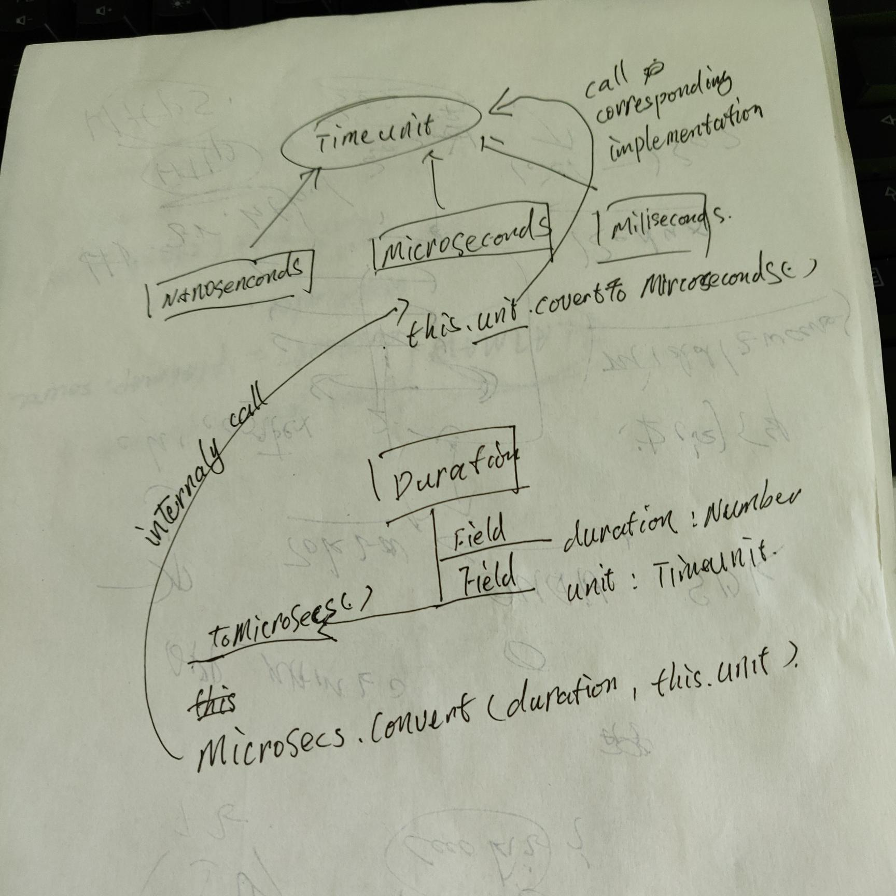

# Notes

## funfix core

* file structure

    ```raw
    .
    ├── disjunctions.ts       // Option, Either, Try 的核心实现
    ├── errors.ts             // 自定义的 Error
    ├── index.ts              // index file
    ├── internals.ts          // functional programming 内部机制的问题.
    ├── kinds.ts              // 定义了 HKT, Constructor
    └── std.ts                // standard function definition, equals, hashCode...etc
    ```

* Higher Kind Type 的实现需要特别关注下, Typescript 是不支持 HKT 的, 所以作者用了 HK<H, A> 这个HK type去模拟了HKT,具体的实现是有论文描述的, 我就没有看了, 太懒了, 也不一定能够看懂. `packages/funfix-core/src/kinds.ts`

```ts
// 拿Option<A>举例来说, 
export interface Functor<F> {
  map<A, B>(f: (a: A) => B, fa: HK<F, A>): HK<F, B>
}

// Option<A> 实现了 HK<"funfix/option", A>
export class Option<A> implements std.IEquals<Option<A>>, HK<"funfix/option", A> {}

// 
export type OptionTypes =
  Setoid<Option<any>> &
  Monad<"funfix/option">

export const OptionModule: OptionTypes = {
    // 这里边Option<A>, 已经实现了 Monad<"funfix/option">, 所以这里边可以替代fa节点的 Type
    map: <A, B>(f: (a: A) => B, fa: Option<A>) =>
    fa.map(f),
}
```

* `jsverify` 这个库也很不错, property test


```ts
// ------------ Custom Error
/**
 * A dummy error that can be used for testing purposes.
 */
export class DummyError extends Error {
  constructor(message?: string) {
    super(message)
    this.name = "DummyError"

    // Workaround to make `instanceof` work in ES5
    const self = this as any
    self.constructor = DummyError
    self.__proto__ = DummyError.prototype
  }
}
```

## funfix-effect

* file structure

  ```
  src
  ├── eval.ts           // Eval<A>, 代表一个layziness 的计算, 最终返回A
  ├── index.ts      
  ├── internals.ts      // 声明了 IteratorLike 的 Type
  └── io.ts
  ```

### Eval
`Eval<A>`, 是base class, 主要的method是`get:()=> A`, 所有Eval的本质是对计算做描述, 然后所有的`flatMap`转换都是对其计算结果做转换, chain 的过程. subtype 有: 

* `Now`, 代表一个 constant value, `get: ()=> return this.value`
* `Once`, 表示内部会计算一次, 然后后面的结果全部会被缓存掉
* `Always`, 代表每次computation都会执行, `get:()=> return this.computation()`
* `Suspend`, 代表了一个`Eval<A>`的 `factory`
* `FlatMap`, 代表flatMap, 用了一个subtype封装了 `(Eval<A> -> Eval<B>) -> Eval<A> -> Eval<B>`这个计算, 


`FlatMap` 和 `Suspend` 是两个非常特别的 Class, 需要特别关注下.


__Trampoline__ : 

```ts
// Eval 中核心计算的 Trampoline. 单独贴在这里是因为其重要性, 
/** @hidden */
type Current = Eval<any>
/** @hidden */
type Bind = ((a: any) => Eval<any>)
/** @hidden */
type CallStack = Array<Bind>

/** @hidden */
function _popNextBind(bFirst: Bind | null, bRest: CallStack | null): Bind | undefined | null {
  if (bFirst) return bFirst
  if (bRest && bRest.length > 0) return bRest.pop()
  return null
}

/** @hidden */
function evalRunLoop<A>(start: Eval<A>): A {
  let current: Current = start
  let bFirst: Bind | null = null
  let bRest: CallStack | null = null

  while (true) {
    switch (current._tag) {
      case "now": // eval start, then cache it.
        const now = current as Now<A>
        const bind = _popNextBind(bFirst, bRest)
        if (!bind) return now.value
        bFirst = null
        current = bind(now.value)
        break

      case "always":
      case "once":
        current = new Now(current.get())
        break

      case "suspend":
        current = (current as Suspend<A>).thunk()
        break

      case "flatMap":
        if (bFirst) {
          if (!bRest) bRest = []
          bRest.push(bFirst)
        }
        const fm = current as FlatMap<any, any>
        bFirst = fm.f
        current = fm.source
        break
    }
  }
}
```

## funfix-exec
* file structure

  ```
  src
  ├── cancelable.ts       // 定义了各种Cancelable instance
  ├── future.ts
  ├── index.ts
  ├── internals.ts        // arrayBSearchInsertPos(), log2(), ...etc
  ├── ref.ts              // DynamicRef, 动态引用, 创建 
  ├── scheduler.ts
  └── time.ts             // TimeUnit, Duration 的定义
  ```


* Cancelable
  * `BoolCancelable`, 具有 `isCanceled` boolean标识
  * `CollectionCancelable`, 可以同时 cancel 多个 cancelable
  * `AssignCancelable`, `update` 函数
  * `MultiAssignCancelable`, 
  * `StackedCancelable`, 内部是一个数组的, 没怎么看懂
  * `ChainedCancelable`, 我是没怎么看懂这个, 其实有点复杂, 但感觉`ChainedCancelable`下面只能跟一个有效的 `ICancelable`, 还是挺复杂的这个地方.
  * 

### time.ts
这里边通过 class 的封装, 实现了函数的多态还是蛮精彩的, 里边的 Class 抽象和彼此的关系很巧妙. 总之是通过Class实现的各个Item的Design创建出的优雅的API.


```ts
// 在执行计算前, 先价差是否会 overflow
/** @hidden */
function x(d: number, m: number, over: number): number {
  if (d > over) return MAX
  if (d < -over) return MIN
  // 执行真正的计算
  return d * m
}

```

* `Math.trunc`, js 中number都是float类型的, 所以判断是不是integer是看对应的float bits有没有被设置上, `trunc` 就是讲float中的binary bits移除掉.





###


## typescript

```
// ! mark in typescript, used in disjunctions.ts
// https://stackoverflow.com/questions/42273853/in-typescript-what-is-the-exclamation-mark-bang-operator-when-dereferenci
// Implements HK<F, A>
/** @hidden */ readonly _URI!: "funfix/option"
/** @hidden */ readonly _A!: A

// binary ops, bit & bit, 这种方式是因为js在进行binary operation的时候会先将bit先转换成32bit的integer number, then perform binary operation.
return 1 << (bit > 30 ? 30 : (bit & bit))

```


# todo

* // 47 is prime number, why is so important about prime number, its relationship with hashCode


# Funfix


[](https://travis-ci.org/funfix/funfix)
[](https://codecov.io/gh/funfix/funfix?branch=master)
[](https://greenkeeper.io/)
[](https://www.npmjs.com/package/funfix)
[](https://gitter.im/funfix/funfix?utm_source=badge&utm_medium=badge&utm_campaign=pr-badge&utm_content=badge)

Funfix is a library of type classes and data types for Functional Programming 
in JavaScript, [TypeScript](https://www.typescriptlang.org/) and [Flow](https://flow.org/).

Inspired by [Scala](http://www.scala-lang.org/), [Cats](http://typelevel.org/cats/)
and [Monix](https://monix.io/).

## Usage

The code is organized in sub-projects, for à la carte dependencies,
but all types, classes and functions are exported by `funfix`, so to
import everything:

```
npm install --save funfix
```

Or you can depend on individual sub-projects, see below.

### Modules: UMD and ES 2015

The library has been compiled using
[UMD (Universal Module Definition)](https://github.com/umdjs/umd),
so it should work with [CommonJS](http://requirejs.org/docs/commonjs.html)
and [AMD](http://requirejs.org/docs/whyamd.html), for standalone usage
in browsers or Node.js.

But it also provides a `module` definition in `package.json`, thus
providing compatibility with
[ECMAScript 2015 modules](https://developer.mozilla.org/en-US/docs/Web/JavaScript/Reference/Statements/import),
for usage when used with a modern JS engine, or when bundling with a
tool chain that understands ES2015 modules,
like [Rollup](https://rollupjs.org/)
or [Webpack](https://webpack.js.org/).

## Sub-projects

Funfix has been split in multiple sub-projects for à la carte
dependency management.  As mentioned above, you can depend on
everything by depending on the `funfix` project. 

These sub-projects are:

### funfix-core 
[](https://www.npmjs.com/package/funfix-core)

Exposes primitive interfaces and data types that need to be
universally available, belonging into a standard library.

**[See JSDoc documentation](https://funfix.org/api/core/)**.

<details><summary>Quick Overview &amp; Usage</summary>

```
npm install --save funfix-core
```

Exposes types for expressing disjunctions:

|                |                                                                                                    |
|----------------|----------------------------------------------------------------------------------------------------|
| [Either](https://funfix.org/api/core/classes/either.html) | data type for expressing results with two possible outcome types (a disjoint union)                |
| [Option](https://funfix.org/api/core/classes/option.html) | data type for expressing optional values                                                           |
| [Try](https://funfix.org/api/core/classes/try.html)       | data type for representing the result of computations that may result in either success or failure |

Standard interfaces and tools for dealing with universal equality and
hash code generation:

|                               |                                                                                                    |
|-------------------------------|----------------------------------------------------------------------------------------------------|
| [IEquals](https://funfix.org/api/core/interfaces/iequals.html)                | an interface for defining universal equality and hash code                                                         |
| [is](https://funfix.org/api/core/globals.html#is) and [equals](https://funfix.org/api/core/globals.html#equals) | for using `IEquals` in tests, or otherwise falls back to JavaScript's equality (`==` or `valueOf()`) |
| [hashCode](https://funfix.org/api/core/globals.html#hashCode)              | for calculating hash codes (for usage in sets and maps data structures) using `IEquals`, or otherwise falls back to calculating a hash from `.valueOf()` or from `.toString()` |
| [isValueObject](https://funfix.org/api/core/globals.html#isValueObject)    | for testing if a given object implements `IEquals` |
  
Standard, reusable error types, that help with some common scenarios,
working with error types being preferable to working with strings:

|                                 |                                                                                                    |
|---------------------------------|----------------------------------------------------------------------------------------------------|
| [DummyError](https://funfix.org/api/core/classes/dummyerror.html)              | for tagging errors used for testing purposes |
| [IllegalArgumentError](https://funfix.org/api/core/classes/illegalargumenterror.html)    | for signaling that a given argument is violating the contract of the called function or constructor |
| [IllegalInheritanceError](https://funfix.org/api/core/classes/illegalinheritanceerror.html) | for signaling that inheriting from a certain class is illegal |
| [IllegalStateError](https://funfix.org/api/core/classes/illegalstateerror.html)       | for signaling that an illegal code branch was executed and thus something is wrong with the code and needs investigation (e.g. a bug) |
| [NoSuchElementError](https://funfix.org/api/core/classes/nosuchelementerror.html)      | thrown when the user expects an element to be returned from a function call, but no such element exists |
| [NotImplementedError](https://funfix.org/api/core/classes/notimplementederror.html)     | thrown in case an implementation is missing |
| [TimeoutError](https://funfix.org/api/core/classes/timeouterror.html)            | thrown in case the execution of a procedure takes longer than expected |
| [CompositeError](https://funfix.org/api/core/classes/compositeerror.html)          | for gathering multiple errors in a single reference that can expose them as a list |

Misc utilities:

|                                 |                                                                                                    |
|---------------------------------|----------------------------------------------------------------------------------------------------|
| [applyMixins](https://funfix.org/api/core/globals.html#applyMixins)    | for working with mixins (i.e. classes used as interfaces, with methods that have default implementations), see [Mixins](https://www.typescriptlang.org/docs/handbook/mixins.html) for an explanation |
| [id](https://funfix.org/api/core/globals.html#id)                      | is the "identity" function                                                                         |

</details>

### funfix-exec 
[](https://www.npmjs.com/package/funfix-exec)

Contains low level / side-effectful utilities and data types for
building higher level concurrency tools.

**[See JSDoc documentation](https://funfix.org/api/exec/)**.

<details><summary>Quick Overview &amp; Usage</summary>

```
npm install --save funfix-exec
```

Scheduling tasks for asynchronous execution:

|                   |                                                                                        |
|-------------------|--------------------------------------------------------------------------------------- |
| [Future](https://funfix.org/api/exec/classes/future.html)    | a lawful, fast, cancelable alternative to JavaScript's `Promise`                       |
| [Scheduler](https://funfix.org/api/exec/classes/scheduler.html) | the alternative to using `setTimeout` for asynchronous boundaries or delayed execution |

In support of futures and schedulers,
[ICancelable](https://funfix.org/api/exec/interfaces/icancelable.html)
data types are introduced for dealing with cancellation concerns:

|                                                    |                                                                                        |
|----------------------------------------------------|--------------------------------------------------------------------------------------- |
| [ICancelable](https://funfix.org/api/exec/interfaces/icancelable.html) and [Cancelable](https://funfix.org/api/exec/classes/cancelable.html)         | for expressing actions that can be triggered to cancel processes / dispose of resources |
| [IBoolCancelable](https://funfix.org/api/exec/interfaces/iboolcancelable.html) and [BoolCancelable](https://funfix.org/api/exec/classes/boolcancelable.html) | for cancelable references that can be queried for their `isCanceled` status |
| [IAssignCancelable](https://funfix.org/api/exec/interfaces/iassigncancelable.html) and [AssignCancelable](https://funfix.org/api/exec/classes/assigncancelable.html)   | for cancelable references that can be assigned (behave like a box for) another reference |
| [MultiAssignCancelable](https://funfix.org/api/exec/classes/multiassigncancelable.html)   | being a mutable cancelable whose underlying reference can be updated multiple times |
| [SingleAssignCancelable](https://funfix.org/api/exec/classes/singleassigncancelable.html) | for building forward references, much like `MultiAssignCancelable` except that it can be assigned only once, triggering an error on the second attempt |
| [SerialCancelable](https://funfix.org/api/exec/classes/serialcancelable.html)             | being like a `MultiAssignCancelable` that cancels its previous underlying reference on updates |

And also types for expressing durations:

|                  |                                                                                        |
|------------------|--------------------------------------------------------------------------------------- |
| [TimeUnit](https://funfix.org/api/exec/classes/timeunit.html) | inspired by Java's own enumeration, representing time| elated units of measurement     |
| [Duration](https://funfix.org/api/exec/classes/duration.html) | inspired by Scala's own type, as a type safe representation for durations              |

</details>

### funfix-effect 
[](https://www.npmjs.com/package/funfix-effect)

Defines monadic data types for controlling laziness, asynchrony and side effects.
Exposes the most advanced `IO` implementation for JavaScript.

**[See JSDoc documentation](https://funfix.org/api/effect/)**.

<details><summary>Quick Overview &amp; Usage</summary>

```
npm install --save funfix-effect
```

The exposed data types:

|              |                                                                                        |
|--------------|--------------------------------------------------------------------------------------- |
| [Eval](https://funfix.org/api/effect/classes/eval.html) | lawful, lazy, monadic data type, that can control evaluation, inspired by the `Eval` type in [Typelevel Cats](http://typelevel.org/cats/) and by the `Coeval` type in [Monix](https://monix.io), a more simple `IO`-like type that can only handle immediate execution, no async boundaries, no error handling, not being meant for suspending side effects. |
| [IO](https://funfix.org/api/effect/classes/io.html)     | lawful, lazy, monadic data type, capable of expressing and composing side effectful actions, including asynchronous, being the most potent and capable alternative to JavaScript's `Promise`, inspired by Haskell's `IO` and by the [Monix Task](https://monix.io/docs/2x/eval/task.html) |

</details>

## TypeScript or Flow?

Funfix supports both [TypeScript](https://www.typescriptlang.org/)
and [Flow](https://flow.org/) type annotations out of the box.

It also makes the best use of the capabilities of each. For example
TypeScript has bivariant generics, but Flow supports variance
annotations and Funfix makes use of them. Development happens in
TypeScript, due to better tooling, but both are first class citizens.

## Contributing

The Funfix project welcomes contributions from anybody wishing to
participate.  All code or documentation that is provided must be
licensed with the same license that Funfix is licensed with (Apache
2.0).

Feel free to open an issue if you notice a bug, have an idea for a
feature, or have a question about the code. Pull requests are also
gladly accepted. For more information, check out the
[contributor guide](CONTRIBUTING.md).

## License

All code in this repository is licensed under the Apache License,
Version 2.0.  See [LICENCE](./LICENSE).

